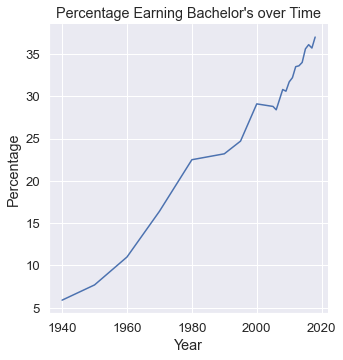
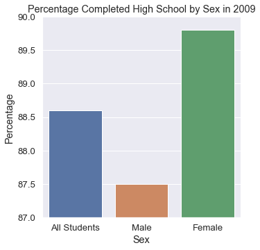
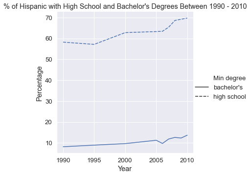
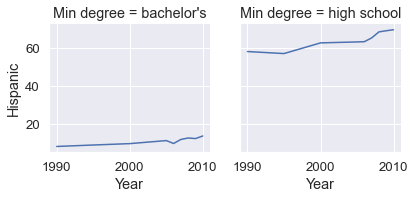

# Data Analysis on Educational Attainment

**Author**: Kyle Chen - 陳證皓

- Data source: [National Center for Education Statistics](https://nces.ed.gov/programs/digest/d18/tables/dt18_104.20.asp)


```python
import pandas as pd
import seaborn as sns
import matplotlib.pyplot as plt
```

##### Data


```python
data = pd.read_csv("data/nces-ed-attainment.csv", na_values="---")
data.tail()
```


<div>
<style scoped>
    .dataframe tbody tr th:only-of-type {
        vertical-align: middle;
    }

    .dataframe tbody tr th {
        vertical-align: top;
    }

    .dataframe thead th {
        text-align: right;
    }
</style>
<table border="1" class="dataframe">
  <thead>
    <tr style="text-align: right;">
      <th></th>
      <th>Year</th>
      <th>Sex</th>
      <th>Min degree</th>
      <th>Total</th>
      <th>White</th>
      <th>Black</th>
      <th>Hispanic</th>
      <th>Asian</th>
      <th>Pacific Islander</th>
      <th>American Indian/Alaska Native</th>
      <th>Two or more races</th>
    </tr>
  </thead>
  <tbody>
    <tr>
      <th>209</th>
      <td>2014</td>
      <td>F</td>
      <td>master's</td>
      <td>9.3</td>
      <td>11.1</td>
      <td>5.0</td>
      <td>3.6</td>
      <td>20.8</td>
      <td>NaN</td>
      <td>NaN</td>
      <td>7.5</td>
    </tr>
    <tr>
      <th>210</th>
      <td>2015</td>
      <td>F</td>
      <td>master's</td>
      <td>10.4</td>
      <td>12.0</td>
      <td>7.2</td>
      <td>4.1</td>
      <td>23.2</td>
      <td>NaN</td>
      <td>NaN</td>
      <td>10.2</td>
    </tr>
    <tr>
      <th>211</th>
      <td>2016</td>
      <td>F</td>
      <td>master's</td>
      <td>11.2</td>
      <td>12.3</td>
      <td>6.3</td>
      <td>6.3</td>
      <td>28.8</td>
      <td>NaN</td>
      <td>NaN</td>
      <td>8.2</td>
    </tr>
    <tr>
      <th>212</th>
      <td>2017</td>
      <td>F</td>
      <td>master's</td>
      <td>10.5</td>
      <td>11.8</td>
      <td>6.8</td>
      <td>5.0</td>
      <td>25.8</td>
      <td>NaN</td>
      <td>NaN</td>
      <td>5.4</td>
    </tr>
    <tr>
      <th>213</th>
      <td>2018</td>
      <td>F</td>
      <td>master's</td>
      <td>10.7</td>
      <td>12.6</td>
      <td>6.2</td>
      <td>3.8</td>
      <td>29.9</td>
      <td>NaN</td>
      <td>NaN</td>
      <td>NaN</td>
    </tr>
  </tbody>
</table>
</div>


#### What were the percentages for women vs. men having earned a Bachelor's Degree in 1980?

Compares the percentages of having bachelor's degree in 1980 by sex,
returns a dataframe with a row for men and a row for women with columns 'Sex' and 'Total'.


```python
df = data[(data['Year'] == 1980) & (data['Sex'] != 'A')]
df = df[df['Min degree'] == "bachelor's"]
df = df[['Sex', 'Total']]
df
```


<div>
<style scoped>
    .dataframe tbody tr th:only-of-type {
        vertical-align: middle;
    }

    .dataframe tbody tr th {
        vertical-align: top;
    }

    .dataframe thead th {
        text-align: right;
    }
</style>
<table border="1" class="dataframe">
  <thead>
    <tr style="text-align: right;">
      <th></th>
      <th>Sex</th>
      <th>Total</th>
    </tr>
  </thead>
  <tbody>
    <tr>
      <th>112</th>
      <td>M</td>
      <td>24.0</td>
    </tr>
    <tr>
      <th>180</th>
      <td>F</td>
      <td>21.0</td>
    </tr>
  </tbody>
</table>
</div>


#### What were the two most commonly awarded levels of educational attainment awarded between 2000-2010 (inclusive) for male?

Returns Series that shows the two most commonly awarded levels of
educational attainment awarded between 2000-2010 for all students.


```python
df = data.loc[data["Sex"] == 'M']

df = df.loc[(df['Year'] >= 2000) & (df['Year'] <= 2010)]
res = df.groupby("Min degree")["Total"].mean()
res.nlargest(2)
```


    Min degree
    high school    85.957143
    associate's    34.557143
    Name: Total, dtype: float64


```python
sns.set(font_scale=1.2) # set font size
```

### Line chart
#### What are the total percentages of all people of bachelor's degree as minimal completion over years


```python
bachelors_df = data[['Year', 'Sex', 'Min degree', 'Total']]
bachelors_df = bachelors_df[(bachelors_df['Sex'] == 'A') &
                            (bachelors_df['Min degree'] == "bachelor's")]
bachelors_df = bachelors_df.dropna(subset=['Total'])

sns.relplot(kind='line', data=bachelors_df, x="Year", y="Total")
plt.title("Percentage Earning Bachelor's over Time")
plt.xlabel("Year")
plt.ylabel("Percentage")
plt.savefig('line_plot_bachelors.png', bbox_inches='tight')
```





### Bar chart
#### What are the total percentages of women, men, and total people with a minimum education of high school degrees in the year 2009?


```python
df = data[['Year', 'Sex', 'Min degree', 'Total']]
df = df[(df['Year'] == 2009) &
                (df['Min degree'] == 'high school')]
df = df.dropna(subset=['Total'])


g = sns.catplot(data=df, x="Sex", y="Total", kind="bar")
g.set(ylim=(87, 90))
g.set_xticklabels(["All Students", "Male", "Female"])
plt.title("Percentage Completed High School by Sex in 2009")
plt.ylabel("Percentage")
plt.savefig('bar_chart_high_school.png', bbox_inches='tight')
```





### Line chart
#### How the percent of Hispanic individuals with degrees has changed between 1990 and 2010 for high school and bachelor's degrees ?


```python
df = data[['Year', 'Min degree', 'Hispanic']]
df = df[(df['Year'] >= 1990) & (df['Year'] <= 2010)]
df = df[(df['Min degree'] == 'high school') |
                (df['Min degree'] == "bachelor's")]
df = df.groupby(['Year', 'Min degree']).mean().reset_index()


sns.relplot(kind='line', data=df, x="Year", y="Hispanic",
            style="Min degree")
plt.title("% of Hispanic with High School and "
          "Bachelor's Degrees Between 1990 - 2010")
plt.xlabel("Year")
plt.ylabel("Percentage")
plt.savefig('plot_hispanic_min_degree.png', bbox_inches='tight')


sep = sns.FacetGrid(df, col="Min degree")
sep.map(sns.lineplot, "Year", "Hispanic")
sep.savefig('seperate_plot_hispanic_min_degree.png', bbox_inches='tight')
```






